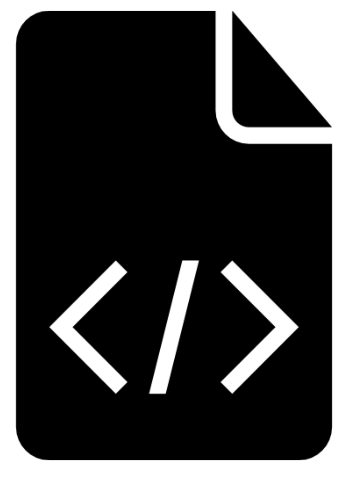

<h1> < Hello World ☕ , my name is Kelvyn Khrystian! /></h1>

<h3>• Estudante de Desenvolvimento Web Full Stack pela Trybe, com estudos de FrontEnd consolidados e agora estudando BackEnd!</h3>

## < Tecnologias />
  

  
  
  
  
  
  
  
  
  
  
  
  

  
## < Ferramentas />
  

  
  
  
  

  
## < Contatos />

 

  
  
  
  
  
  

##

  <a href="https://github.com/kelvynkhrystian">
  
  

